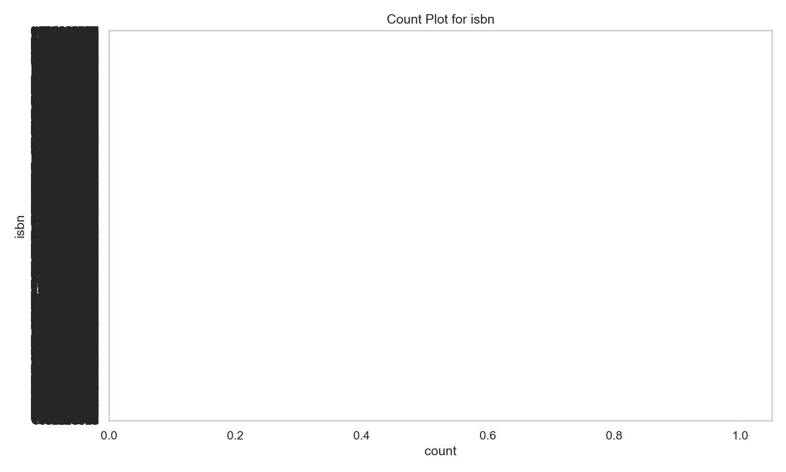
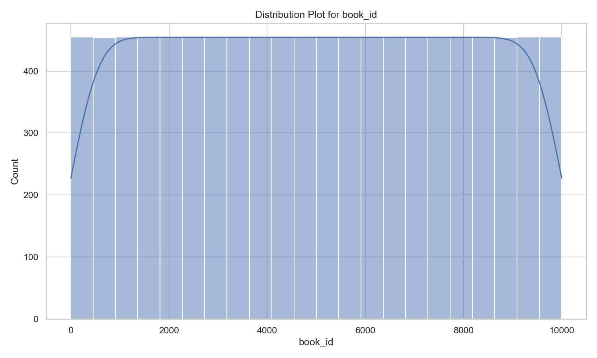

# Automated Dataset Analysis

**Story Description of the Book Dataset Analysis**

In a world brimming with literature, the vast dataset I undertook for analysis contained key insights regarding 10,000 books, capturing various attributes that define literary works. The dataset includes columns that provide unique identifiers for each book, their ISBN numbers, author details, publication years, titles, ratings, and more. Through a systematic exploration of this dataset, I aimed to uncover patterns, correlations, and the underlying stories woven within the numbers.

### Analysis Performed

1. **Summary Statistics**: I initiated the analysis by computing summary statistics for each column, which provided a snapshot of the dataset. Key indicators, such as the mean and standard deviation for attributes like average rating (mean: 4.00) and ratings count (mean: 54,001), revealed that the books generally enjoyed positive reviews. Notably, I also detected several missing values in critical fields, including ISBN, original title, language code, and publication year.

2. **Missing Values**: Identifying missing values proved essential for understanding the dataset's integrity. The counts indicated a significant absence of ISBN (700 missing) and original titles (585 missing) among other fields. This information could affect further analyses, particularly in identifying books accurately.

3. **Correlation Analysis**: A correlation matrix was generated to examine the relationship between various attributes. It unveiled significant negative correlations between ratings counts and several other metrics, including work text reviews count (-0.419) and ratings for different star categories (e.g., ratings 1 through 5). Interestingly, the ratings count correlated highly with work ratings count (0.995) and ratings of 4 and 5 stars, suggesting that a higher volume of ratings often accompanies well-received books.

4. **Visualizing Distributions**: I created several visualizations, including a distribution plot for book IDs, showcasing a uniform distribution across the dataset with books sequentially numbered from 1 to 10,000. This distribution implies a systematic cataloging of books, making it easy for researchers and readers to navigate through the dataset.

5. **Count Plot for ISBN Values**: The count plot illustrated the frequency of valid ISBN numbers, demonstrating that a vast majority of the books possess unique identifiers. This aspect is crucial for proper cataloging and ensures that users can find and reference the books effectively.

### Insights

The analysis surfaced several intriguing insights:

- **Publication Trends**: The average publication year hovered around 1982, highlighting that a significant number of older literary works are represented in this collection. This could suggest a historical interest in certain genres or authors that have persisted through time.

- **Author Popularity**: With 4,664 unique authors, the dataset reflects a rich tapestry of authorship, though the frequency analysis showed that Stephen King was notably the most prolific, with 60 entries. The implications suggest that prominent authors dominate the ratings landscape, influencing overall perceptions of quality in the dataset's contents.

- **Rating Patterns**: The metrics indicate that the average rating of 4.00 suggests a trend towards positive reception of books across the board. However, the correlation analysis shows that books with higher ratings tend to acquire a larger number of reviews, indicating a feedback loop where popular books continue to attract more ratings and reviews.

### Implications

The findings of this analysis have significant implications for various stakeholders:

- **Readers**: Understanding which books have higher ratings and the correlation with ratings count can guide readers toward popular and well-loved literature.

- **Publishers & Authors**: Insights into publication trends and author popularity can help inform publishing strategies, focusing on genres and authors that have a lasting impact on readers.

- **Researchers**: For those studying literary trends and reader responses over time, this dataset provides a treasure trove of structured information conducive to deeper analysis.

Overall, this dataset is a window into the literary world, filled with stories waiting to be uncovered, and the analysis serves to enrich our understanding of reading preferences and trends over the years. As we move into the future, leveraging these insights could potentially shape the next era of literature�one where data-driven decisions guide the industry to cater effectively to reader interests.

