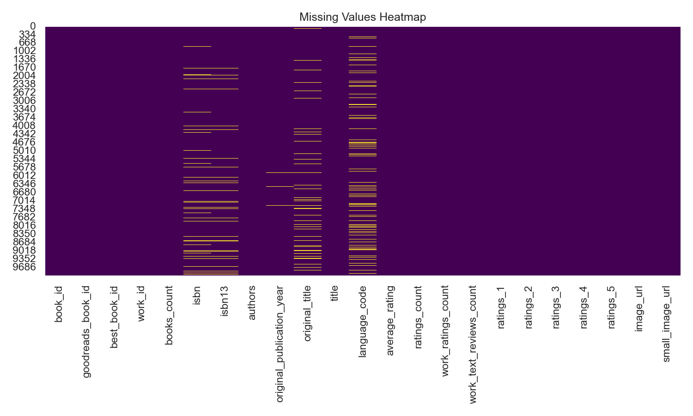

# Automated Dataset Analysis

**Story: Unveiling the Literary Landscape through Dataset Analysis**

In the extensive world of literature, books breathe life into stories, experiences, and knowledge, capturing the hearts of countless readers. To dive into this vast literary ocean, a dataset comprising 10,000 books has been meticulously compiled, revealing intricate details about the books’ identities, authors, publication history, and reader reception. This dataset forms the foundation of our analysis, aimed at shedding light on trends and patterns within the literary realm, ultimately enabling stakeholders to make informed decisions.

### The Dataset Overview

The dataset is rich with information, featuring 22 columns detailing aspects such as `book_id`, `goodreads_book_id`, `authors`, `original_publication_year`, `average_rating`, `ratings_count`, `work_text_reviews_count`, and the number of ratings from 1 to 5. Herein lies a treasure trove of data regarding book popularity, author prominence, and reader engagement.

Upon initial inspection, the subsequent summary statistics unveil the nature of this dataset. Notably, the average book has an average rating of approximately 4.00, indicating a generally favorable reception by readers. The average `ratings_count` is about 54,001, revealing an engaged community that participates in reviewing and rating numerous books. Remarkably, Stephen King emerges as the most prolific author with 60 appearances, underscoring his enduring influence in contemporary literature.

### Dealing with Missing Values

While the dataset shines brightly, it is not without blemishes. Several columns exhibit missing values—most notably, `isbn` (700 missing entries) and `isbn13` (585 missing entries)—limiting our ability to uniquely identify some books. Additionally, `language_code` shows 1,084 missing values, which might skew insights concerning linguistic diversity in the dataset.

### Correlation Analysis

A crucial aspect of the analysis involves examining correlations between key variables. The correlation matrix reveals intriguing insights. For instance, `ratings_count` and `work_ratings_count` display a strong positive correlation (0.995), hinting at a relationship between how frequently a book is rated and the overall number of ratings the associated work attracts. Conversely, ratings of lower values exhibit negative correlations with `books_count`, suggesting that an increase in total book outputs could dilute an individual book's ratings.

The correlation between `average_rating` and `ratings_5` (0.115) suggests that higher-rated books receive more 5-star ratings. However, it also signifies a more extensive pattern where books are rated uniformly high, perhaps reflecting a reader bias for popular titles.

### Insights and Implications

1. **Popularity of Authors**: The dominance of authors like Stephen King signals opportunities for publishers and booksellers to focus on promotional strategies around well-established authors. Consideration should also be given to emerging authors with increasing ratings and engagement as future bestsellers.

2. **Understanding Reader Preferences**: The insights about ratings patterns illustrate that readers tend to rate books positively. This could imply that the books listed have a generally favorable quality or that bias exists in reader preferences. Understanding reader segmentation—what attracts certain demographics—can enhance targeted marketing efforts.

3. **Title Diversity and Publication Trends**: The dataset includes several entries with missing values in `original_publication_year` and `original_title`, potentially indicating a lack of historical inclusivity. Publishers and researchers must consider diversifying their catalogs to offer a more representative selection of voices and stories from various years and backgrounds.

4. **Language Code Representation**: With 1,084 missing entries in `language_code`, there lies a substantial opportunity for expansion into multilingual literature, enlightening readers' experiences through diverse narratives and viewpoints.

### The Road Ahead

This dataset, analyzed through various lenses, offers vital insights into the literary landscape. It assists stakeholders—from publishers to retailers—in navigating engagement strategies, identifying market opportunities, and understanding readership dynamics. 

Continued exploration of the dataset could unveil deeper patterns, especially with more granular analysis over time or through natural language processing tools to analyze review sentiments. In a time where discovering one's next favorite read can feel overwhelming, leveraging data to guide readers not only curates their reading experiences but also fosters a more inclusive and richly diverse book market. 

In conclusion, the journey through this dataset exemplifies how literature remains an indispensable treasure trove that, with the right analytical tools, can continue to enrich lives across cultures and generations.

