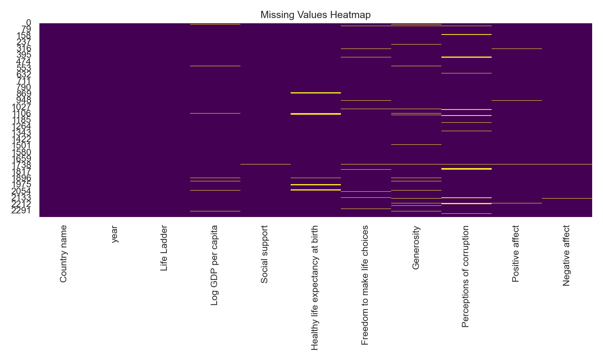
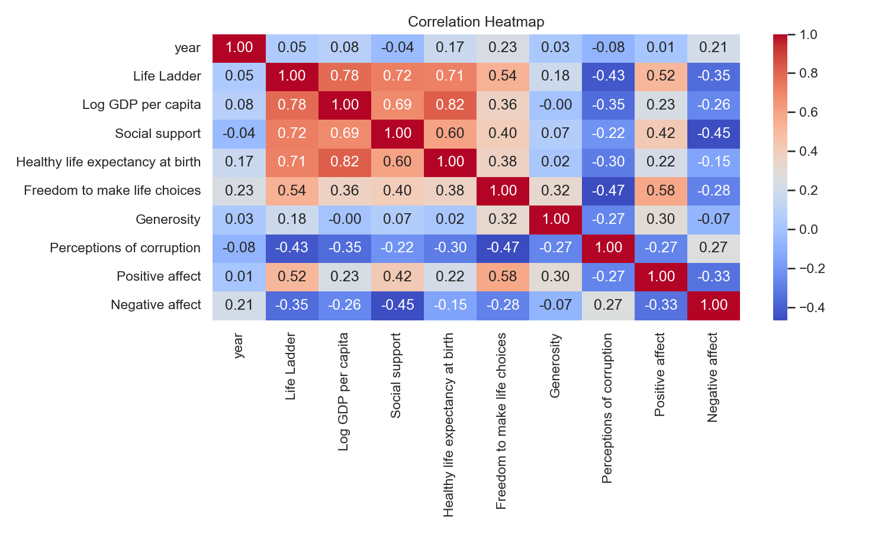
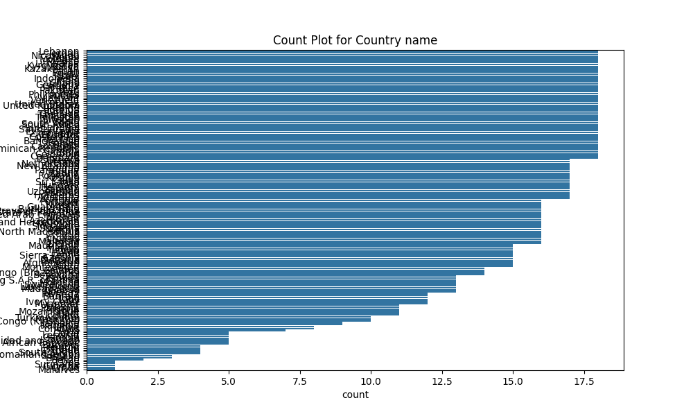

# Automated Dataset Analysis

### Story: Analyzing Global Well-Being and Economic Indicators

#### Introduction
In an era where global challenges are constantly evolving, understanding the interrelation between economic parameters and well-being is essential. We conducted a comprehensive analysis of a dataset containing various indicators reflecting the quality of life across multiple countries from 2005 to 2023. The dataset includes variables such as the "Life Ladder," economic stability indicated by "Log GDP per capita," social support levels, health outcomes, and subjective experiences quantified through measures like freedom of choice, generosity, and perceptions of corruption.

#### Dataset Overview
The dataset comprises **2,363 rows** and **11 columns** encapsulating various dimensions of happiness and well-being across **165 unique countries**. Each entry corresponds to a particular country's data for a specific year, featuring metrics that gauge both economic prosperity and subjective well-being. The key columns include:

- **Life Ladder**: A subjective evaluation of quality of life rated on a scale.
- **Log GDP per capita**: A measure of economic activity.
- **Social support**: The perceived support available in times of need.
- **Healthy life expectancy at birth**: The average number of years a newborn is expected to live in good health.
- **Freedom to make life choices**: The level of autonomy individuals feel in their lives.
- **Generosity and perceptions of corruption**: Metrics capturing societal attitudes.
- **Positive and negative affect**: These illustrate people's emotional experiences.

#### Summary Statistics
The analysis of summary statistics revealed valuable insights into the dataset:
- The mean Life Ladder score was approximately **5.48** (on a scale where higher values represent better life quality), with a standard deviation of **1.13**, indicating variability in perceptions of well-being across nations.
- The average **Log GDP per capita** was **9.40**, correlating to economic performance; however, missing values were found in this domain (28 entries missing).
- There were notable gaps in **Healthy life expectancy at birth** with **63 years** representing the average, yet **63 missing values** indicated potential health disparities across countries.

#### Correlation Analysis
We conducted a correlation analysis to explore the relationships between different variables. Key findings include:
- A strong positive correlation of **0.78** between **Life Ladder** and **Log GDP per capita**, suggesting that higher economic prosperity tends to relate to improved life satisfaction.
- Significant correlations were also found between **Life Ladder** and **Social support** (**0.72**) and **Healthy life expectancy at birth** (**0.71**), underscoring the importance of social and health dimensions in subjective well-being.
- Notably, a negative correlation emerged between **Life Ladder** and **Perceptions of corruption** (correlation of **-0.43**), indicating that higher corruption levels may lead to decreased life satisfaction.

#### Insights and Implications
The analysis presented significant insights that can influence policy and societal change:

1. **The Importance of Economic Stability**: The strong relationship between economic indicators and life satisfaction highlights the necessity for policies aimed at promoting economic growth and equitable income distribution. Enhancing GDP per capita could potentially uplift overall happiness levels across nations.

2. **Social Connectivity as a Cornerstone**: The correlation between life satisfaction and social support stresses the need for public programs that bolster community connections and mental health resources. Ensuring individuals feel supported can create a significant uplift in perceived well-being.

3. **Health Systems Matter**: With health expectancy directly influencing life satisfaction, investments in health systems and preventive care can have long-term benefits for society's overall happiness.

4. **Addressing Corruption**: The evident link between negative societal perceptions, particularly corruption, and life satisfaction suggests that tackling corruption should be a priority for governments to enhance citizen happiness and trust.

5. **Policy Recommendations**: Governments across the globe can benefit from implementing policies that not only focus on economic growth but also prioritize improving social support networks, healthcare systems, and reducing corruption.

#### Conclusion
This analysis firmly establishes that understanding well-being is multifaceted, intertwining economic factors with health and social dimensions. The implications of these findings advocate for holistic approaches in policy-making that can foster an environment conducive to not just economic prosperity but genuine societal well-being. The dataset serves as a powerful tool in the ongoing quest to enhance quality of life worldwide, providing insights that can be a catalyst for transformative change.

