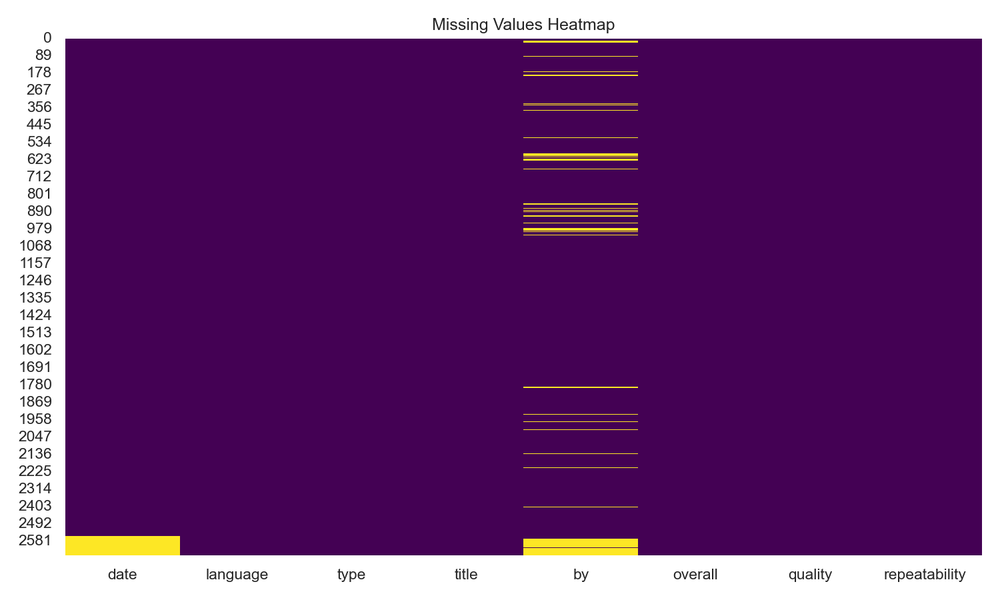

# Automated Dataset Analysis

### Dataset Story: Analyzing Media Reviews

#### Overview

In an era characterized by an overload of media content, understanding audience reception and preferences has become crucial for creators and distributors. The dataset at hand contains 2,652 records of reviews from various media, including movies, books, and other content types. It comprises several attributes, including the date of review, language, type of media, title, reviewer, and quantitative ratings for overall impression, quality, and repeatability.

#### Data Composition

The dataset encompasses the following key columns:

- **date**: The date when the review was submitted, which provides temporal insights into trends in media reception.
- **language**: The primary language of the reviewed content, hinting at audience demographics and media diversity.
- **type**: The classification of the media, primarily populated by 'movie' with other categories present.
- **title**: The title of the reviewed content, enabling an examination of specific media popularity.
- **by**: The reviewer’s name, offering insights into influential voices within the dataset.
- **overall**, **quality**, **repeatability**: Ratings reflecting reviewers' assessment of the media on a scale of 1 to 5, giving a measurable way to gauge public sentiment.

#### Key Findings from Analysis

1. **Missing Values**: Upon examination, the dataset revealed missing values primarily in the 'date' column (99 missing entries) and the 'by' column (262 missing entries). These gaps can affect the robustness of temporal analyses and the assessment of reviewer influence.

2. **Language Diversity**: The reviews are written in 11 different languages, with 'English' being the most prevalent. This suggests a primarily English-speaking audience or a focus on English-language media, which could indicate a need for more representation in other languages.

3. **Content Type Prevalence**: 'Movies' dominate the dataset, making up 83.4% of the entries. This strong inclination towards films can limit the understanding of audience reception across other media types like books or series, highlighting an opportunity to branch out.

4. **Reviewer Patterns**: Notably, Kiefer Sutherland emerged as the most frequent reviewer, with 48 reviews to his name. This concentration of reviews raises interesting questions about the influence of specific reviewers and their potential biases.

5. **Rating Insights**: 
   - The average 'overall' rating stands at approximately 3.05, suggesting a neutral to slightly positive reception of reviewed media.
   - 'Quality' ratings average around 3.21, reflecting slightly better perceptions of quality than overall satisfaction.
   - 'Repeatability' scores are notably lower, averaging 1.49, indicating that while media might be received well, it may not encourage repeated viewing or engagement, a critical aspect for media longevity.

6. **Correlation Analysis**: 
   - There exists a strong positive correlation (0.83) between overall ratings and quality ratings, indicating that better quality perceptions often align with higher overall impressions.
   - Repeatability exhibits medium correlation with both overall (0.51) and quality ratings (0.31), suggesting nuances in how audiences perceive media quality and their desire for revisitation.

#### Implications and Recommendations

The insights drawn from this dataset can shape future content strategies:

- **Targeting Linguistic Diversity**: To improve engagement across diverse audiences, filmmakers and content creators could explore producing more content in languages other than English.
  
- **Expanding Media Types**: Given the focus on movies, there's significant potential for content producers to diversify their output in other media formats, which could attract a wider audience.

- **Understanding Reviewer Impact**: By analyzing the influence of prominent reviewers like Kiefer Sutherland, stakeholders can leverage their voices for marketing purposes or identify new influencers to partner with.

- **Enhancing Quality for Longevity**: The disparity between quality ratings and repeatability indicates a need for creators to balance quality with factors that promote repeated engagement, such as robust narratives or interactive elements in media.

In conclusion, this dataset not only serves as a snapshot of audience sentiment towards various media but also offers actionable insights that can guide media producers and marketers in enhancing their strategies for future endeavors. By addressing these findings, the industry can aim to align more closely with viewer expectations and preferences, ultimately fostering a more engaged and satisfied audience base.

